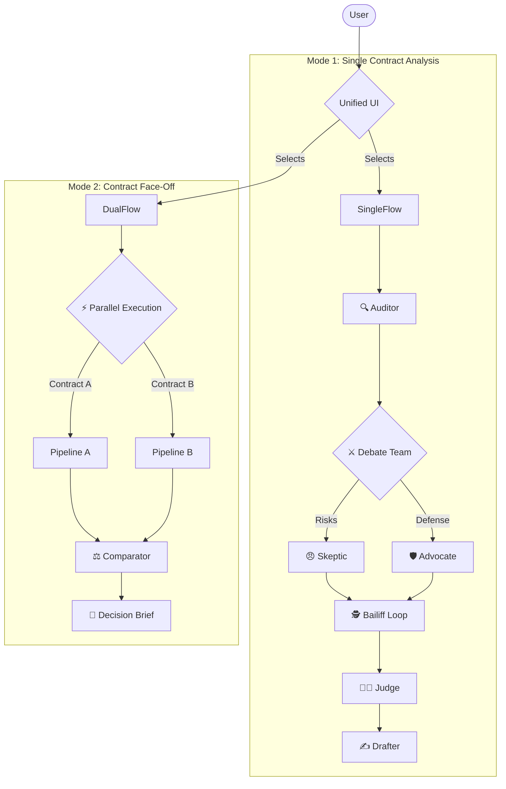
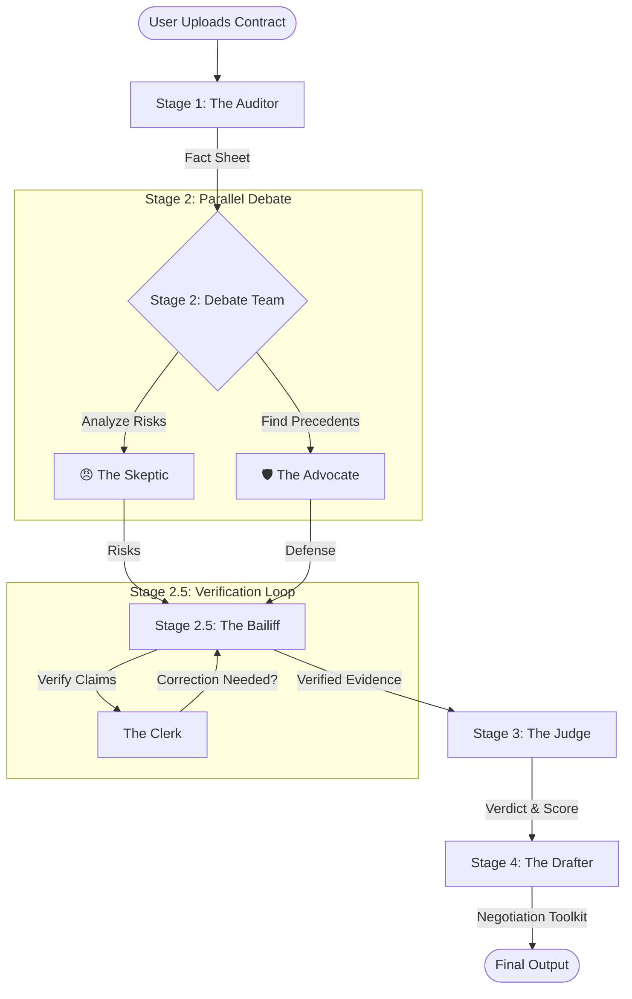

# ⚖️ ShouldISignThis? - The AI Consensus Engine for Contract Review

> **"Don't just sign it. Debate it."**

**ShouldISignThis?** is an advanced multi-agent system that simulates a legal team to review contracts. It offers two powerful modes: **Single Contract Analysis** for deep dives and **Contract Face-Off** for comparing two options side-by-side.

---

## 🏗️ Architecture

The system utilizes a **Parallel-Sequential-Loop** architecture powered by Google Gemini models and the Google Agent Development Kit (ADK).

### The Workflow



---

## 🤖 The Agents

| Agent | Role | Model | Description |
| :--- | :--- | :--- | :--- |
| **🔍 Auditor** | Ingestion | `gemini-2.5-pro` | Extracts key facts (Dates, Parties, Terms) and validates the document is a contract. |
| **😠 Skeptic** | Risk Analysis | `gemini-2.0-flash-lite` | A paranoid lawyer who finds every potential trap, ambiguity, and risk. |
| **🛡️ Advocate** | Defense | `gemini-2.0-flash-lite` | A pragmatic deal-maker who uses **Google Search** to find industry standards to defend the terms. |
| **🕵️ Bailiff** | Verification | `gemini-2.0-flash-lite` | **Self-Correction Loop**. Verifies that the Skeptic's claims are actually supported by the contract text (Anti-Hallucination). |
| **👨‍⚖️ Judge** | Verdict | `gemini-2.5-pro` | Weighs the arguments, calculates a Risk Score (0-100), and issues a final verdict (Accept/Caution/Reject). |
| **✍️ Drafter** | Action | `gemini-2.0-flash-lite` | Generates a "Negotiation Toolkit" containing strategy notes and a ready-to-send email script. |
| **⚖️ Comparator** | Comparison | `gemini-2.5-pro` | Analyzes two contracts side-by-side to identify the safer option (Educational Use Only). |
| **📧 CompDrafter** | Strategy | `gemini-2.0-flash-lite` | Generates a "Decision Brief" email for stakeholders explaining the comparison results. |

---

## 🛠️ Technical Implementation

### Core Technologies
*   **Orchestration**: Custom `orchestrator.py` handling async agent execution.
*   **Framework**: Google ADK (Agent Development Kit).
*   **Models**: Gemini 2.5 Pro (Reasoning) & Gemini 2.0 Flash Lite (Speed).
*   **State Management**: SQLite database for session persistence.
*   **UI**: Streamlit with Sidebar Navigation.

### Key Features
*   **Unified UI**: Seamlessly switch between Single Analysis and Comparison modes.
*   **Nested Parallelism**: In "Face-Off" mode, two full analysis pipelines run concurrently.
*   **Self-Correction**: The Bailiff/Clerk loop actively detects and fixes hallucinations.
*   **Tool Use**: Agents have access to `RiskCalculator` and `GoogleSearch`.
*   **Security**: Secure API Key propagation, 5MB File Limit, Input sanitization.

---

## 🚀 Setup & Usage

### Prerequisites
*   Python 3.10+
*   Google Cloud API Key (with Gemini API access)

### Installation

1.  **Clone the repository**
    ```bash
    git clone https://github.com/yourusername/shouldisignthis.git
    cd shouldisignthis
    ```

2.  **Install dependencies**
    ```bash
    python3 -m venv .venv
    source .venv/bin/activate
    pip install -r requirements.txt
    ```

3.  **Configuration**
    *   **API Key**: You can enter it in the UI or set it in `shouldisignthis/config.yaml`.
    *   **Logging**: Logs are saved to `logs/contract_audit.log` (Configurable in `config.yaml`).

### Running the App
```bash
./run_demo.sh
# OR
streamlit run shouldisignthis/app.py
```

### Running Tests
The project includes a comprehensive test suite.
```bash
# Run the full end-to-end integration test
python3 -m shouldisignthis.tests.test_integration

# Run the comparison integration test
python3 -m shouldisignthis.tests.test_comparator_integration
```

---

## 📂 Project Structure

```text
shouldisignthis/
├── app.py                  # Main Entry Point (Unified UI)
├── orchestrator.py         # Agent Orchestration Logic
├── config.py               # Configuration Loader
├── ui/                     # UI Modules
│   ├── single_mode.py      # Single Contract Analysis UI
│   └── compare_mode.py     # Contract Face-Off UI
├── agents/                 # Agent Definitions
│   ├── auditor.py          # Stage 1
│   ├── debate_team.py      # Stage 2 (Parallel)
│   ├── bailiff.py          # Stage 2.5 (Loop)
│   ├── judge.py            # Stage 3
│   ├── drafter.py          # Stage 4 & 6
│   └── comparator.py       # Stage 5
├── tools/                  # Custom Tools
└── tests/                  # Unit & Integration Tests
```

> **"Don't just sign it. Debate it."**

**ShouldISignThis?** is an advanced multi-agent system that simulates a legal team to review contracts. Instead of a single LLM providing a generic summary, it orchestrates a team of specialized AI agents to argue, verify, and judge the document, ensuring you get a balanced and fact-checked analysis.

---

## 🏗️ Architecture

The system utilizes a **Parallel-Sequential-Loop** architecture powered by Google Gemini models and the Google Agent Development Kit (ADK).

### The Workflow



---

## 🤖 The Agents

| Agent | Role | Model | Description |
| :--- | :--- | :--- | :--- |
| **🔍 Auditor** | Ingestion | `gemini-2.5-pro` | Extracts key facts (Dates, Parties, Terms) and validates the document is a contract. |
| **😠 Skeptic** | Risk Analysis | `gemini-2.0-flash-lite` | A paranoid lawyer who finds every potential trap, ambiguity, and risk. |
| **🛡️ Advocate** | Defense | `gemini-2.0-flash-lite` | A pragmatic deal-maker who uses **Google Search** to find industry standards to defend the terms. |
| **🕵️ Bailiff** | Verification | `gemini-2.0-flash-lite` | **Self-Correction Loop**. Verifies that the Skeptic's claims are actually supported by the contract text (Anti-Hallucination). |
| **👨‍⚖️ Judge** | Verdict | `gemini-2.5-pro` | Weighs the arguments, calculates a Risk Score (0-100), and issues a final verdict (Accept/Caution/Reject). |
| **✍️ Drafter** | Action | `gemini-2.0-flash-lite` | Generates a "Negotiation Toolkit" containing strategy notes and a ready-to-send email script. |

---

## 🛠️ Technical Implementation

### Core Technologies
*   **Orchestration**: Custom `orchestrator.py` handling async agent execution.
*   **Framework**: Google ADK (Agent Development Kit).
*   **Models**: Gemini 2.5 Pro (Reasoning) & Gemini 2.0 Flash Lite (Speed).
*   **State Management**: SQLite database for session persistence.
*   **UI**: Streamlit for real-time pipeline visualization.

### Key Features
*   **Parallel Execution**: The Skeptic and Advocate run concurrently to reduce latency.
*   **Self-Correction**: The Bailiff/Clerk loop actively detects and fixes hallucinations before they reach the Judge.
*   **Tool Use**: Agents have access to `RiskCalculator` and `GoogleSearch`.
*   **Security**:
    *   Secure API Key propagation (no global env vars).
    *   10MB File Upload Limit.
    *   Input sanitization.

---

## 🚀 Setup & Usage

### Prerequisites
*   Python 3.10+
*   Google Cloud API Key (with Gemini API access)

### Installation

1.  **Clone the repository**
    ```bash
    git clone https://github.com/yourusername/shouldisignthis.git
    cd shouldisignthis
    ```

2.  **Install dependencies**
    ```bash
    python3 -m venv .venv
    source .venv/bin/activate
    pip install -r requirements.txt
    ```

3.  **Configuration**
    *   **API Key**: You can enter it in the UI or set it in `shouldisignthis/config.yaml`.
    *   **Logging**: Logs are saved to `logs/contract_audit.log` (Configurable in `config.yaml`).

### Running the App
```bash
streamlit run shouldisignthis/app.py
```

### Running Tests
The project includes a comprehensive test suite.
```bash
# Run the full end-to-end integration test
python3 -m shouldisignthis.tests.test_integration

# Run individual agent tests
python3 -m shouldisignthis.tests.test_judge
```

---

## 📂 Project Structure

```text
shouldisignthis/
├── app.py                  # Main Streamlit Application (UI)
├── orchestrator.py         # Agent Orchestration Logic
├── config.py               # Configuration Loader
├── config.yaml             # App Configuration (Models, Logging)
├── database.py             # SQLite Session Service
├── agents/                 # Agent Definitions
│   ├── auditor.py          # Stage 1
│   ├── debate_team.py      # Stage 2 (Parallel)
│   ├── bailiff.py          # Stage 2.5 (Loop)
│   ├── judge.py            # Stage 3
│   └── drafter.py          # Stage 4
├── tools/                  # Custom Tools
│   ├── risk_calculator.py
│   └── search_tools.py
└── tests/                  # Unit & Integration Tests
```
