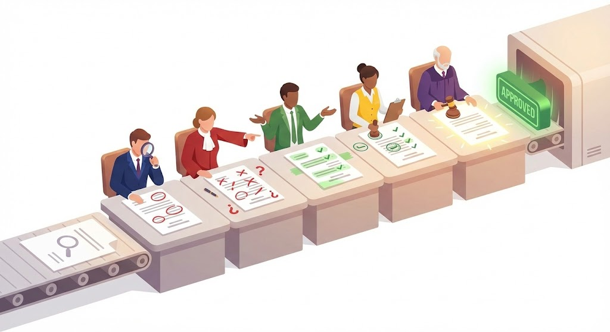
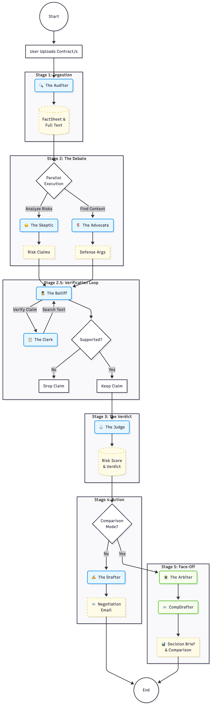
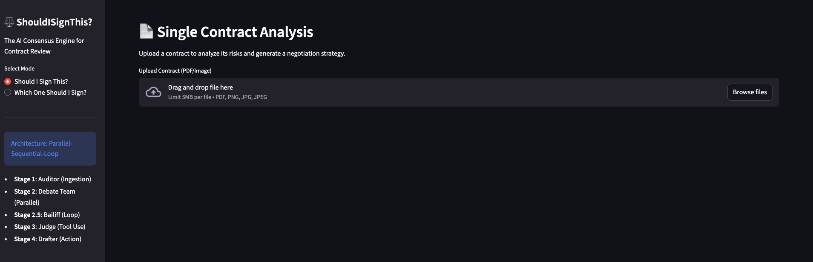
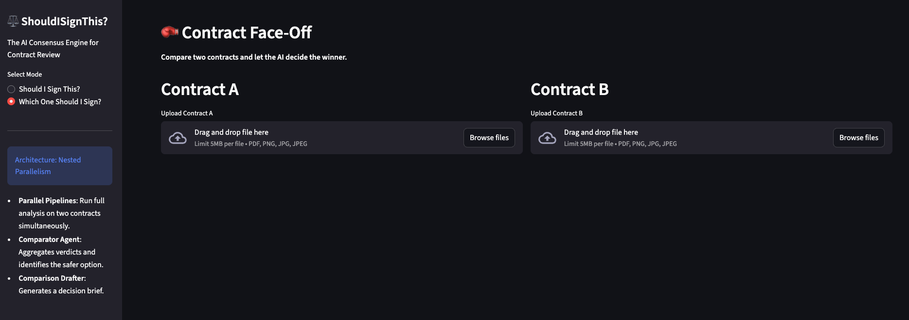
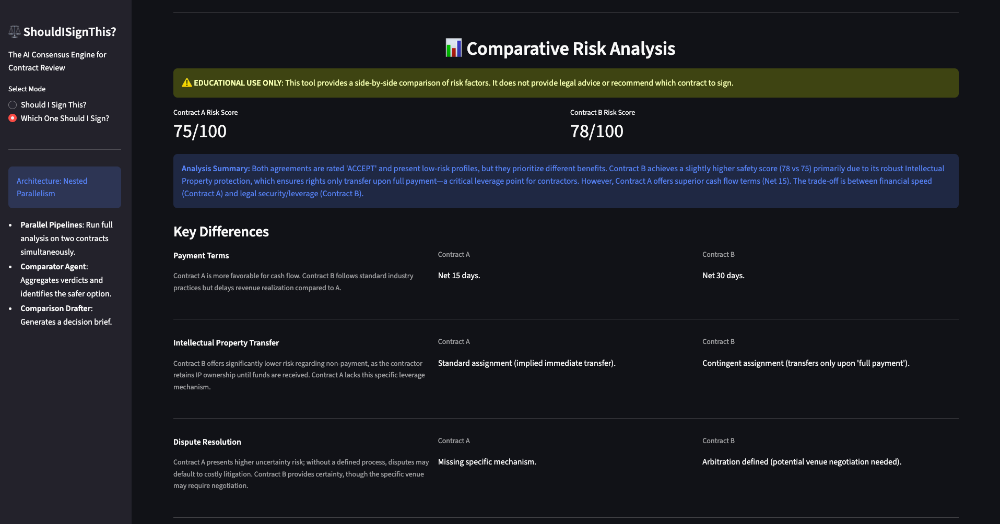
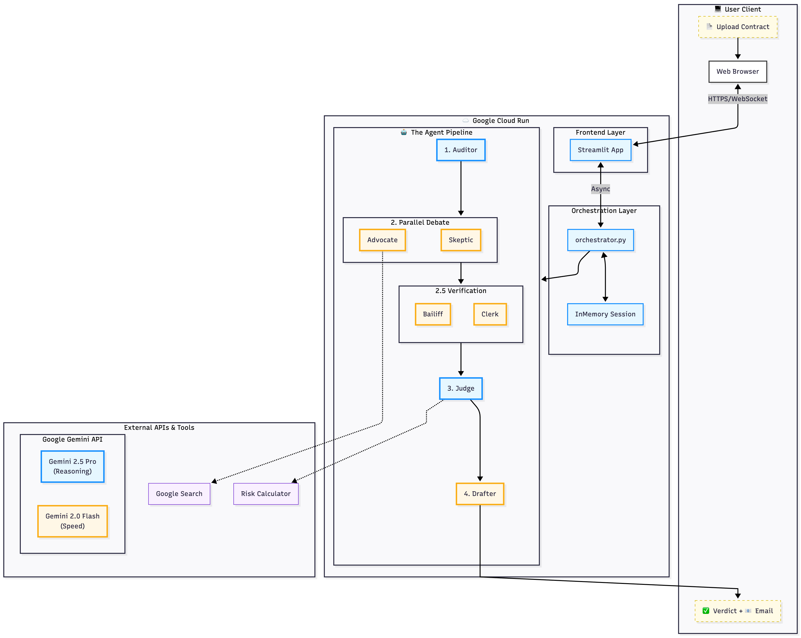
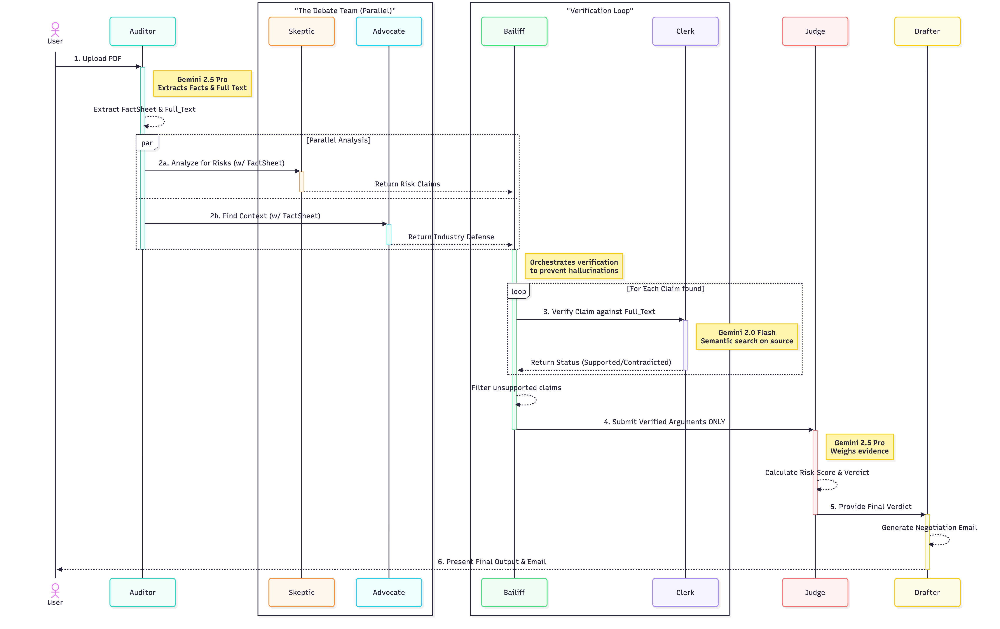
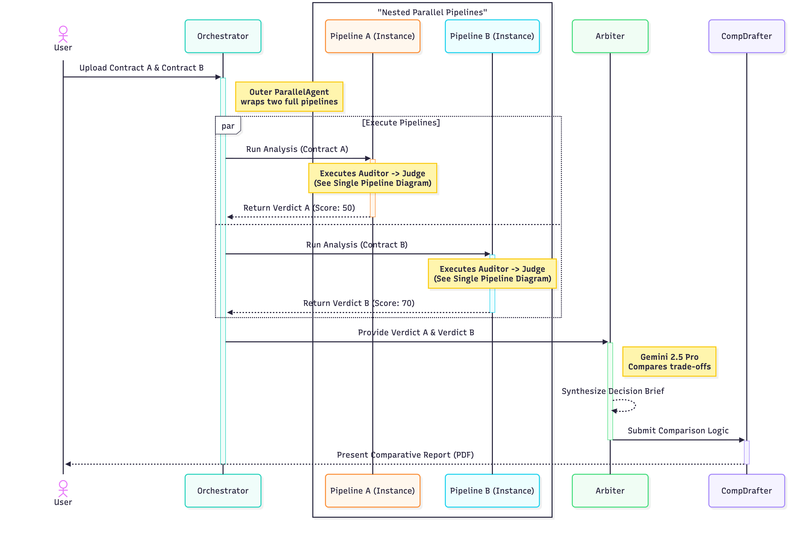

# ⚖️ ShouldISignThis?
### The AI Consensus Engine for Contract Review

<div align="center">

> **"Don't trust one AI with your contract—make eight of them argue about it first."**

<br>

[](https://github.com/sambit04126/shouldisignthis)

<br>

[]()
[](https://www.python.org/downloads/)
[](https://github.com/google/genai-agent-development-kit)
[](https://deepmind.google/technologies/gemini/)
[](https://cloud.google.com/run)
[](LICENSE)

<br>

**ShouldISignThis?** simulates a specialized legal team to review contracts. Instead of relying on a single LLM's opinion, it orchestrates a team of **8 specialized AI agents** that debate risks, search for industry context, and—crucially—**verify their own claims against the source text** to prevent hallucinations.

Get a fact-checked, balanced, and actionable analysis in under 60 seconds.

[View Demo](#demo-gallery) • [Read the Architecture](#architecture-deep-dive) • [Getting Started](#getting-started)

</div>

---

## 🧠 The Logic Core

Before seeing the UI, it is important to understand **how the agents think**. Unlike standard chatbots, we use a **Parallel-Sequential-Loop** architecture to ensure accuracy.

### The Verification Pipeline

*Figure 1: The "Trust but Verify" Pipeline. Note the crucial **Verification Loop (Stage 2.5)** where the Bailiff and Clerk agents intercept potential risks and cross-reference them against the raw contract text. If a risk is not supported by evidence, it is filtered out before reaching the Judge.*

---

## 🎯 The Problem

Contracts govern every professional relationship, yet most people sign them blind. The traditional options are broken: hiring a lawyer is too expensive ($500+/hr) for everyday agreements, and standard LLMs are prone to **hallucinations**.

| The Reality | The Risk |
| :--- | :--- |
| **63%** of professionals sign contracts without understanding them. [(Source: Adobe)](https://blog.adobe.com/en/publish/2024/02/27/future-of-contracts-generative-ai) | We tested leading LLMs. They frequently invented clauses that didn't exist (e.g., *"The contract includes a 24-month non-compete"* when none was present). |
| **71%** of freelancers struggle to collect payment due to vague terms. [(Source: Freelancers Union)](https://freelancersunion.org/blog/freelancers-union-releases-2023-freelance-economic-impact-report/) | A single-perspective AI won't catch subtle omissions that a human lawyer would flag immediately. |

---

## <a name="demo-gallery"></a>🖼️ Demo Gallery

[](https://www.youtube.com/watch?v=zrZQ2NvluhY)

### 1. Single Contract Analysis

*Real-time view of the agent orchestration pipeline analyzing a single document. The sidebar shows exactly which agent is "thinking."*

### 2. Real-Time Parallel Execution ("Face-Off")

*Nested parallelism in action. Two full agent pipelines run simultaneously to compare competing offers, visualized by independent progress trackers.*

### 3. The Comparative Decision Brief

*The final output: side-by-side risk scores, key differences, and actionable advice.*

---

## <a name="architecture-deep-dive"></a>🏗️ Architecture Deep Dive

This project is built using **Google's Agent Development Kit (ADK)** and deployed as a serverless application containerized with Docker on **Google Cloud Run**.

### 1. High-Level System Architecture

*Figure 2: Cloud Infrastructure. The application runs on Google Cloud Run, utilizing a "Speed Team" of agents (powered by **Gemini 2.0 Flash**) for debate and verification, and a "Reasoning Team" (powered by **Gemini 2.5 Pro**) for final judgment.*

### 2. Sequence Diagram: The Verification Protocol

*Figure 3: Detailed Message Flow. This diagram illustrates the **Bailiff/Clerk Loop**. Notice how the Clerk searches the `Full_Text` for evidence and returns `SUPPORTED` or `CONTRADICTED` statuses.*

### 3. Sequence Diagram: Parallel Orchestration

*Figure 4: Nested Parallelism. In "Face-Off Mode," an outer Orchestrator wraps two complete instances of the pipeline. They execute concurrently, reducing total wait time by ~40%.*

---

## 🤖 The Agent Roster

| Agent | Role | Model | Persona/Function |
| :--- | :--- | :--- | :--- |
| 🔍 **Auditor** | Ingestion | `Gemini 2.5 Pro` | Precise fact extraction; validating document type. |
| 😠 **Skeptic** | Debate | `Gemini 2.0 Flash` | Paranoid lawyer; finds every potential trap or ambiguity. |
| 🛡️ **Advocate** | Debate | `Gemini 2.0 Flash` | Pragmatic deal-maker; uses **Google Search** tool to find industry standards for context. |
| 🕵️ **Bailiff** | Verify | `Gemini 2.0 Flash` | Loop manager; coordinates the verification process. |
| 📋 **Clerk** | Verify | `Gemini 2.0 Flash` | The fact-checker; validates claims against source text. |
| ⚖️ **Judge** | Verdict | `Gemini 2.5 Pro` | Reasoning engine; weighs verified arguments to issue a final score. |
| ✍️ **Drafter** | Action | `Gemini 2.0 Flash` | Generates negotiation emails and strategy notes. |
| 🏛️ **Arbiter** | Face-Off | `Gemini 2.5 Pro` | Synthesizes two separate Judge verdicts into a comparison brief. |

---

## 🧪 Technical Highlights & Testing

### Key Concepts Applied
This project demonstrates advanced patterns from the Google AI Agents Intensive course:
* **Multi-Agent Orchestration:** A heterogeneous team with distinct roles.
* **Parallel Execution:** Using ADK's `ParallelAgent` to run the Debate team concurrently.
* **Looping Patterns:** Implementing a custom `LoopAgent` to iteratively check facts.
* **Tool Use:** Integrating Google Search for external grounding and custom Python calculators.
* **Observability:** Integrated `LoggingPlugin` for real-time thought tracing.

### Ground Truth Regression Testing ⭐
How do you ensure a prompt change doesn't break the legal analysis? We implemented an automated **LLM-as-a-Judge** evaluation pipeline.
1.  We captured "Golden" baseline outputs for standard contracts.
2.  Our test suite runs new code against these inputs.
3.  A supervisor LLM semantically compares the new output against the golden baseline to detect drift in logic or accuracy.

**Run the tests:**
```bash
# Run all tests (Unit + Integration + Ground Truth)
pytest

# Run only Ground Truth tests
pytest shouldisignthis/tests/test_ground_truth.py

# Generate Report
python shouldisignthis/tests/generate_report.py
```

### ⚙️ Configuration
The system is highly configurable via YAML files:
*   `shouldisignthis/config.yaml`: Main application config (models, logging, safety settings).
*   `shouldisignthis/ground_truth_config.yaml`: Specialized config for regression testing (uses `gemini-3-pro-preview`).
*   `shouldisignthis/test_config.yaml`: Config for unit/integration tests.

**Logging:**
*   Application logs: `logs/contract_audit.log`
*   Test logs: `logs/tests.log`

---

## <a name="getting-started"></a>🚀 Getting Started

### Prerequisites
* Python 3.11+ (Required for SSL/importlib features)
* Docker (Optional, for containerized deployment)
* A Google Cloud Project with the Gemini API enabled.

### Option 1: Run Locally (Recommended for Dev)

We provide a helper script to set up the environment and run the app:

```bash
# 1. Clone repo
git clone https://github.com/sambit04126/shouldisignthis.git
cd shouldisignthis

# 2. Set API Key
export GOOGLE_API_KEY="your_gemini_api_key"

# 3. Run the demo script (handles venv setup)
./run_demo.sh
```

### Option 2: Run with Docker
```bash
# 1. Build and run
docker compose up --build

# 2. Access UI
open http://localhost:8080
```

### Option 2: Deploy to Google Cloud Run

This application is built to be serverless-ready.

```bash
# 1. Authenticate
gcloud auth login
gcloud config set project YOUR_PROJECT_ID

# 2. Deploy from source
gcloud run deploy shouldisignthis \
  --source . \
  --platform managed \
  --region us-central1 \
  --allow-unauthenticated \
  --set-env-vars GOOGLE_API_KEY=your_api_key
```
---
### 🔧 Troubleshooting

| Issue | Solution |
| :--- | :--- |
| **`GOOGLE_API_KEY` not found** | Ensure you set `export GOOGLE_API_KEY="AIza..."` in your terminal before running docker compose. |
| **Port 8080 busy** | Change the port in `docker-compose.yml` to `8081:8080` and access at `http://localhost:8081`. |
| **Docker permission denied** | Run with `sudo docker compose up` or check your Docker user group settings. |
-----

### Course & Instructors

A heartfelt thank you to the incredible team behind the **[5-Day AI Agents Intensive Course with Google](https://www.kaggle.com/learn-guide/5-day-agents)** hosted on Kaggle. This project wouldn't exist without your guidance:


### Built With

- [Google ADK](https://github.com/google/genai-agent-development-kit) - Agent Development Kit
- [Google Gemini](https://deepmind.google/technologies/gemini/) - LLM Models (2.5 Pro & 2.0 Flash)
- [Streamlit](https://streamlit.io/) - Web UI Framework

### AI-Assisted Development

This project was built with the help of AI tools, embracing the future of human-AI collaboration:

| Tool | How It Helped |
|------|---------------|
| **[Google Gemini](https://gemini.google.com/)** | Brainstorming architecture patterns, debugging prompts, code generation |
| **[Claude](https://claude.ai/)** | Code review, documentation writing, architectural discussions |
| **[NotebookLM](https://notebooklm.google.com/)** | Research synthesis, understanding complex ADK documentation |
| **[Antigravity](https://antigravity.google/)** | Google's new agentic IDE - The primary development environment |

### Creative Tools

- **[Canva](https://www.canva.com/)** - Demo video creation and editing
- **[Mermaid](https://mermaid.js.org/)** - Architecture and sequence diagrams

## 📄 License

Distributed under the MIT License. See `LICENSE` for more information.

-----

<div align="center">
<b>Developed for the Kaggle AI Agents Intensive Capstone Project (2025)</b>
</div>
